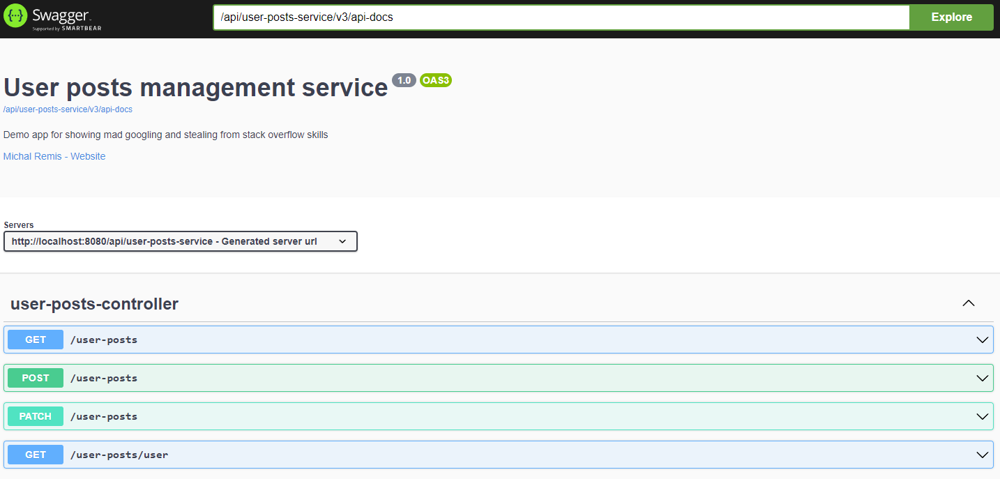
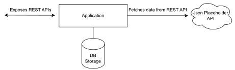

[](https://dl.circleci.com/status-badge/redirect/gh/m-remis/user-posts-management-service/tree/main)

## User Posts Management Service

#### Simple Spring Boot demo application that provides REST APIs for managing user posts.

All functional requirements are covered by unit tests.

### Functional requirements:

#### Add post 
  - need to validate userId using external API

#### Post view (based on id or userId)
  - if the post is not found in the system, it needs to be searched using an external API and saved (valid only for
    searching using the post id)

#### Post removal

#### Editing the post
 - ability to change the title and body

### External API can be found here

[Json Placeholder](https://jsonplaceholder.typicode.com/)

#### Apis used:

[Json Placeholder posts API](https://jsonplaceholder.typicode.com/posts)

[Json Placeholder users API](https://jsonplaceholder.typicode.com/users)

### The format of the post is as follows:

<table>
  <tr>
    <th>Name</th>
    <th>Typer</th>
  </tr>
  <tr>
    <td>id</td>
    <td>Integer</td>
  </tr>
  <tr>
    <td>userId</td>
    <td>Integer</td>
  </tr>
  <tr>
    <td>title</td>
    <td>String</td>
  </tr>
  <tr>
    <td>body</td>
    <td>String</td>
  </tr>
</table>

### This project uses

<table>
  <tr>
    <th>Tech stack</th>
  </tr>
  <tr>
    <td>Java 17</td>
  </tr>
  <tr>
    <td>Maven</td>
  </tr>
  <tr>
    <td>Spring Boot 3</td>
  </tr>
  <tr>
    <td>H2 (tests)</td>
  </tr>
  <tr>
    <td>Postgres SQL</td>
  </tr>
  <tr>
    <td>Flyway</td>
  </tr>
  <tr>
    <td>Docker</td>
  </tr>
  <tr>
    <td>Tomcat replaced by JBoss Undertow (no reason)</td>
  </tr>
  <tr>
    <td>SpringDoc OpenAPI UI (Swagger UI)</td>
  </tr>
  <tr>
    <td>Hibernate</td>
  </tr>
</table>

### Make sure to have installed

* [Git](https://git-scm.com/downloads)

* [JDK 17 or later](https://adoptium.net)

* [Maven 3.8.8 or later](https://maven.apache.org/download.cgi)

* [Docker](https://www.docker.com/)

### DB Structure

Flyway is used for automatic DB migration on application start.

* [Flyway DB Migration scripts](src/main/resources/db/migration)

### Build & Test:

```
mvn clean install
```

Tests run in "test" profile and use in memory H2 db together with flyway

### How to start:

Start dependencies in docker (this will start PostgreSQL container required to run this application, alternatively you
can use your already running instance / container, just make sure to change application-dev.yml, app will create it's
own schema)

```
docker-compose up -d
```

Start application in dev profile

```
java -jar -Dspring.profiles.active=dev user-posts-management-service\target\user-posts-management-service-0.0.1-SNAPSHOT.jar
```

### Swagger UI:

This project uses OpenAPI for documentation

Swagger UI can be found under

```
{server-url}/api/user-posts-service/swagger-ui/index.html
```

#### For local testing, click [here](http://localhost:8080/api/user-posts-service/swagger-ui/index.html) after running the application to redirect to Swagger UI



### YAML API Specification:

Specification can be downloaded under

```
{server-url}/api/user-posts-service/v3/api-docs.yaml
```

#### For local testing, click [here](http://localhost:8080/api/user-posts-service/v3/api-docs.yaml) after running the application to download the file

### Simplified visual representation


